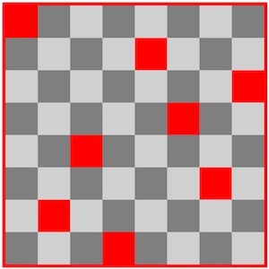

# CSCI 2254 Web App Development

### Spring 2017

**R. Muller**

------

### Lecture Notes: Friday February 17, 2017

#### Today

1. In Class Lab: Modularity in JS — the model-view-update webapp architecture

------
The [eight queens problem](https://en.wikipedia.org/wiki/Eight_queens_puzzle) involves placing 8 queens on a chess board in such a way that none are attacked. 



As we discussed in class, a solution to the eight queens problem in JS can be modularized by designing it as a standard [model-view-update](https://guide.elm-lang.org/architecture/) web application. 

+ The **model** represents the **state** of the application;
+ the **view** is a function that maps a model to an appropriate visualization (an HTML element) of the model;
+ and **update** is a function that maps an old model to a new model.

This software design pattern, called the [Elm Architecture](https://guide.elm-lang.org/architecture/), is a refinement or advancement on the older design pattern called [model view controller](https://en.wikipedia.org/wiki/Model%E2%80%93view%E2%80%93controller). The model-view-update design can and should be used for almost all web applications.

The `problem/` folder contains harness code for solving the eight queens problem. Your task is to implement the view function

```javascript
view : model -> HTML element
```

A solution will be posted halfway through the lab.